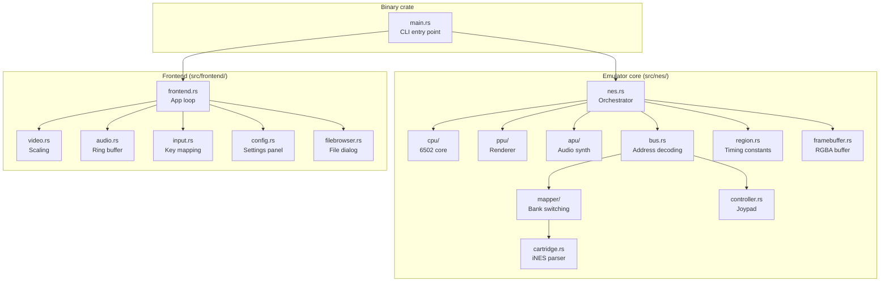

# Project Architecture

This chapter describes the structure of the nes-rs codebase and the key design decisions behind it.

## Module layout



## Core / frontend separation

The codebase has a clean boundary between the **emulator core** (`src/nes/`) and the **frontend** (`src/frontend/`). The core has no dependency on raylib or any rendering library — it operates entirely on the `Framebuffer` (a flat RGBA byte array) and audio samples.

The `Emulator` trait defines the interface between the two:

```rust
pub(crate) trait Emulator {
    fn update(&mut self, dt_ms: f64);
    fn framebuffer(&self) -> &Framebuffer;
    fn set_buttons(&mut self, player: u8, buttons: Buttons);
    fn set_sprite_limit(&mut self, enabled: bool);
    fn region(&self) -> Region;
    fn set_region_override(&mut self, region: Option<Region>);
    fn load_rom(&mut self, data: &[u8]) -> anyhow::Result<()>;
}
```

This trait-based design means the core could be reused with a different frontend (e.g., a web-based renderer via WASM) without any changes.

## Ownership and borrow management

The `Nes` struct owns all emulator state: CPU, PPU, APU, Bus, and two framebuffers. The main challenge is Rust's borrow checker — a CPU step needs mutable access to the bus, and the bus needs to route APU register accesses, but `Nes` owns both.

The solution is to temporarily **park** the APU in the bus during each CPU step:

```rust
fn cpu_step(&mut self) -> cpu::StepResult {
    self.bus.apu = self.apu.take();          // Move APU into bus
    let result = self.cpu.step(&mut self.bus, &mut self.ppu);
    self.apu = self.bus.apu.take();          // Move APU back
    result
}
```

This avoids `RefCell` or `unsafe` while keeping the ownership model clear.

## CPU implementation

The CPU is implemented as a table-driven interpreter:

1. **Opcode table** (`opcodes.rs`) — A 256-entry lookup table mapping opcodes to their handler function, addressing mode, instruction size, and base cycle count.
2. **Addressing modes** (`addr.rs`) — Resolves each mode into an effective address or immediate value.
3. **Handlers** (`handlers.rs`) — One function per instruction mnemonic (LDA, STA, ADC, etc.).
4. **Step loop** (`step.rs`) — Ties it all together: fetch, decode, resolve, execute, advance.

Instructions return a `StepOk` variant indicating how many bytes to advance PC and how many cycles were consumed.

## PPU implementation

The PPU is organized by function:

- **`tick.rs`** — The `TickOutput` enum (Idle, Nmi, FrameReady).
- **`render.rs`** — Per-cycle rendering logic: background fetch pipeline, sprite evaluation, pixel composition.
- **`regs.rs`** — CPU-facing register I/O (PPUCTRL, PPUMASK, PPUSTATUS, etc.).
- **`addr.rs`** — PPU address space: routing reads/writes to VRAM, palette, or mapper.
- **`palette.rs`** — The 64-entry system color table.

Sprite evaluation happens at cycle 257 of each scanline. Pattern data for up to 8 (or 64 with sprite limit disabled) sprites is fetched and stored in `sprite_patterns[]` for the next scanline's rendering.

## APU implementation

The APU follows the hardware structure closely:

- **`channels/`** — Each channel (pulse, triangle, noise, DMC) is a self-contained struct with `tick()` and `output()` methods.
- **`units/`** — Shared components (envelope, length counter, sweep, linear counter) used by multiple channels.
- **`sequencer.rs`** — Frame sequencer that generates quarter-frame and half-frame clock signals.
- **`mixer.rs`** — Nonlinear mixer with precomputed lookup tables.

## Mapper trait

All mappers implement the `Mapper` trait. The `from_cartridge()` factory function inspects the mapper ID from the iNES header and returns the appropriate implementation as a `Box<dyn Mapper>`.

Mappers that support scanline counting (MMC3) implement `notify_scanline()` — called by the PPU at cycle 260 of each visible scanline.

## Linting and safety

The project enforces strict linting via `Cargo.toml`:

- `unsafe_code = "deny"` — No unsafe code except where raylib's FFI requires it (audio callback, V-Sync toggle).
- `unwrap_used = "deny"` — All fallible operations use `.get()`, `.map_or()`, or `anyhow::Result`.
- `clippy::pedantic` — Enabled with targeted relaxations for numeric casts (essential for emulator code that constantly converts between u8, u16, and usize).

## Dependencies

| Crate | Purpose |
|-------|---------|
| `raylib` | Window, rendering, audio, input |
| `clap` | CLI argument parsing |
| `nom` | iNES header parsing |
| `bitflags` | Button state, CPU flags |
| `anyhow` | Error handling |
| `rfd` | Native file dialog |
| `tracing` | Structured logging |
| `tracing-subscriber` | Log output and filtering |
