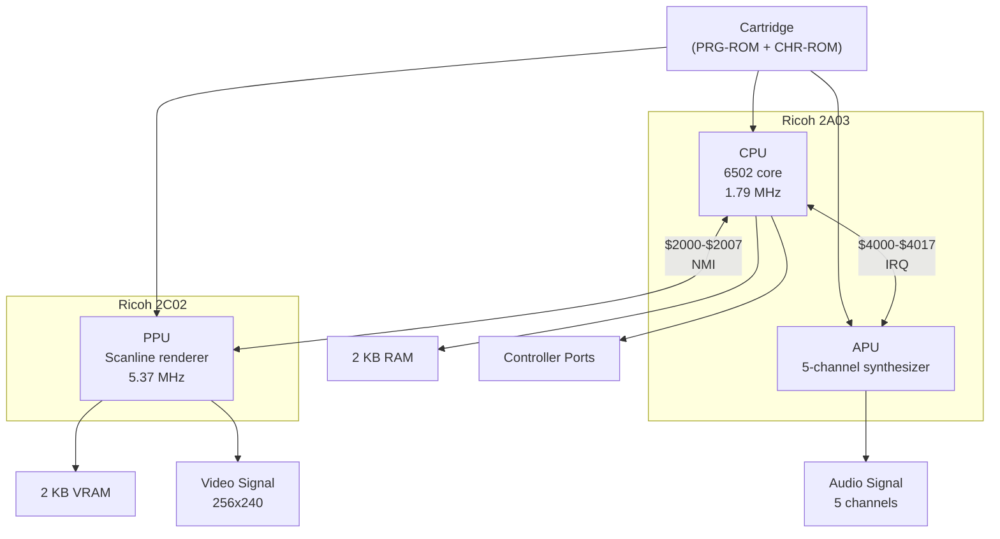

# Architecture Overview

The Nintendo Entertainment System is built around three custom chips that work in concert to produce video and audio output from game cartridges.

## Block diagram

## The three chips

### CPU — Ricoh 2A03

The 2A03 is a modified MOS 6502 processor running at **1.789773 MHz** (NTSC) or **1.662607 MHz** (PAL). It differs from a standard 6502 in two ways:

1. **No decimal mode.** The `SED` instruction exists but has no effect — the ADC and SBC instructions always use binary arithmetic.
2. **Built-in APU.** The audio processing unit is integrated into the same die as the CPU.

The CPU executes game logic, reads controller input, and programs the PPU and APU through memory-mapped registers.

### PPU — Ricoh 2C02

The Picture Processing Unit generates the video signal. It has its own **16 KB address space** and operates at 3x the CPU clock (NTSC) or 3.2x (PAL). The PPU renders:

- A **background layer** composed of 8x8 pixel tiles from a nametable (tile map).
- A **sprite layer** of up to 64 independently positioned 8x8 or 8x16 sprites, with at most 8 visible per scanline.

The PPU communicates with the CPU through 8 memory-mapped registers at `$2000`–`$2007`.

### APU — Audio Processing Unit

The APU is embedded within the 2A03 CPU chip and generates audio through five channels:

| Channel | Type | Output range |
|---------|------|-------------|
| Pulse 1 | Square wave with 4 duty cycles | 0–15 |
| Pulse 2 | Square wave with 4 duty cycles | 0–15 |
| Triangle | Triangle wave (32-step) | 0–15 |
| Noise | LFSR-based pseudo-random noise | 0–15 |
| DMC | 1-bit delta-encoded sample playback | 0–127 |

The APU is programmed through registers at `$4000`–`$4017`.

## Clock relationships

All timing in the NES derives from a single master clock crystal. The CPU, PPU, and APU divide it differently:

| Component | NTSC | PAL |
|-----------|------|-----|
| Master clock | 21.477272 MHz | 26.601712 MHz |
| CPU clock | master / 12 = 1.789773 MHz | master / 16 = 1.662607 MHz |
| PPU clock | master / 4 = 5.369318 MHz | master / 5 = 5.320342 MHz |
| PPU dots per CPU cycle | 3 | 3.2 (16/5) |
| APU clock | = CPU clock | = CPU clock |

The PPU produces one pixel ("dot") per PPU cycle. A complete scanline is 341 dots, and a complete frame is 262 scanlines (NTSC) or 312 scanlines (PAL).

## Communication between subsystems

The CPU is the orchestrator. It drives the other subsystems through memory-mapped I/O:

- **CPU ↔ PPU** — The CPU writes to PPU registers (`$2000`–`$2007`) to configure rendering, set scroll position, and transfer sprite data. The PPU signals the CPU via the **NMI** (non-maskable interrupt) at the start of vertical blanking.
- **CPU ↔ APU** — The CPU writes to APU registers (`$4000`–`$4017`) to program channel frequencies, volumes, and waveforms. The APU can signal the CPU via **IRQ** from the frame counter or DMC.
- **CPU ↔ Cartridge** — The CPU reads game code from PRG-ROM and can write to mapper registers to switch ROM banks.
- **PPU ↔ Cartridge** — The PPU reads tile graphics from CHR-ROM/RAM through the mapper. Some mappers (MMC3) use the PPU's address bus activity to count scanlines.
