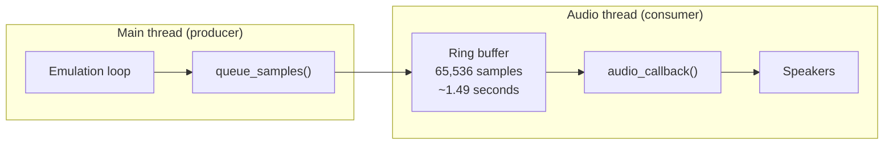

# Audio Pipeline

This chapter traces the path from APU synthesis to audible sound through the speakers.

## Pipeline overview


## Synthesis (CPU clock rate)

All five APU channels are ticked once per CPU cycle (~1.79 MHz NTSC). Each channel produces a digital output:

| Channel | Output | Range |
|---------|--------|-------|
| Pulse 1 | Duty cycle × envelope | 0–15 |
| Pulse 2 | Duty cycle × envelope | 0–15 |
| Triangle | 32-step sequence | 0–15 |
| Noise | LFSR × envelope | 0–15 |
| DMC | 7-bit DAC level | 0–127 |

The five outputs are combined by the nonlinear mixer into a single floating-point sample (0.0–~1.0) every cycle. This is stored in `Apu::out_sample`.

## Down-sampling

The APU runs at ~1.79 MHz, but audio output is at 44,100 Hz. nes-rs uses a **Bresenham accumulator** to point-sample at the target rate without floating-point division:

```rust
self.sample_clock += SAMPLE_RATE;          // += 44,100
if self.sample_clock >= cpu_clock_hz {     // >= 1,789,773
    self.sample_clock -= cpu_clock_hz;
    let sample = apu.out_sample;
    // ... process and queue
}
```

This fires approximately every 40.6 CPU cycles, producing one audio sample. Over time, the Bresenham counter distributes samples evenly — no jitter accumulates.

## DC-blocking high-pass filters

The raw APU output contains DC offsets (the waveforms are not centered around zero). The real NES has AC-coupling capacitors in the audio output path that remove this DC component. nes-rs emulates this with two cascaded first-order high-pass filters:

```rust
// Stage 1
hp1_out = 0.995 * (hp1_out + sample - hp1_in);
hp1_in = sample;

// Stage 2
hp2_out = 0.995 * (hp2_out + hp1_out - hp2_in);
hp2_in = hp1_out;
```

The coefficient **0.995** gives a cutoff frequency of approximately **35 Hz** at 44,100 Hz. Two cascaded stages provide 12 dB/octave rolloff, which:
- Settles DC shifts ~2x faster than a single stage
- Does not distort the triangle channel's ramp waveform

The filtered sample is then converted to a signed 16-bit PCM value:

```rust
let pcm = (hp2_out * i16::MAX as f32).clamp(i16::MIN, i16::MAX) as i16;
```

## Ring buffer

Audio samples are passed from the emulation thread to the audio thread through a **lock-free single-producer, single-consumer ring buffer**:



The ring buffer has a capacity of 65,536 samples (2^16), providing approximately 1.49 seconds of buffering at 44,100 Hz. It uses two atomic indices (`write` and `read`) for synchronization — no mutex, no allocation.

### Producer (main thread)

The emulation loop accumulates samples in a local `Vec` during `update()`, then flushes them all at once:

```rust
RING.push(&sample_batch);
```

### Consumer (audio thread)

Raylib calls the audio callback when it needs more samples. The callback pops from the ring buffer:

```rust
extern "C" fn audio_callback(buffer: *mut c_void, frames: c_uint) {
    let buf: &mut [i16] = /* ... */;
    RING.pop_into(buf, 0);
}
```

If the ring buffer has fewer samples than requested, the remaining slots are filled with the last available sample (sample-and-hold), which prevents audible pops from sudden silence.

## Audio stream configuration

| Parameter | Value |
|-----------|-------|
| Sample rate | 44,100 Hz |
| Bit depth | 16-bit signed |
| Channels | 1 (mono) |
| Sub-buffer size | 2,048 frames |

The sub-buffer size (2,048 frames ≈ 46 ms) controls the latency between the emulator producing a sample and the audio hardware playing it. Smaller values reduce latency but increase the risk of underruns.

## Volume control

The master volume is applied at the raylib `AudioStream` level:

```rust
audio_stream.set_volume(config.volume / 100.0);
```

This scales all samples uniformly without affecting the emulation-side mixing. The volume range is 0–100, set via the configuration panel slider.
