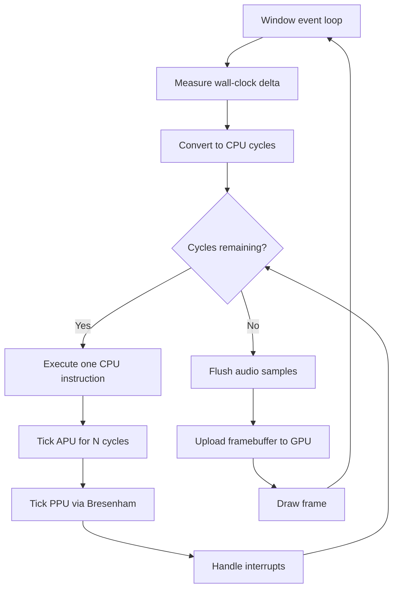
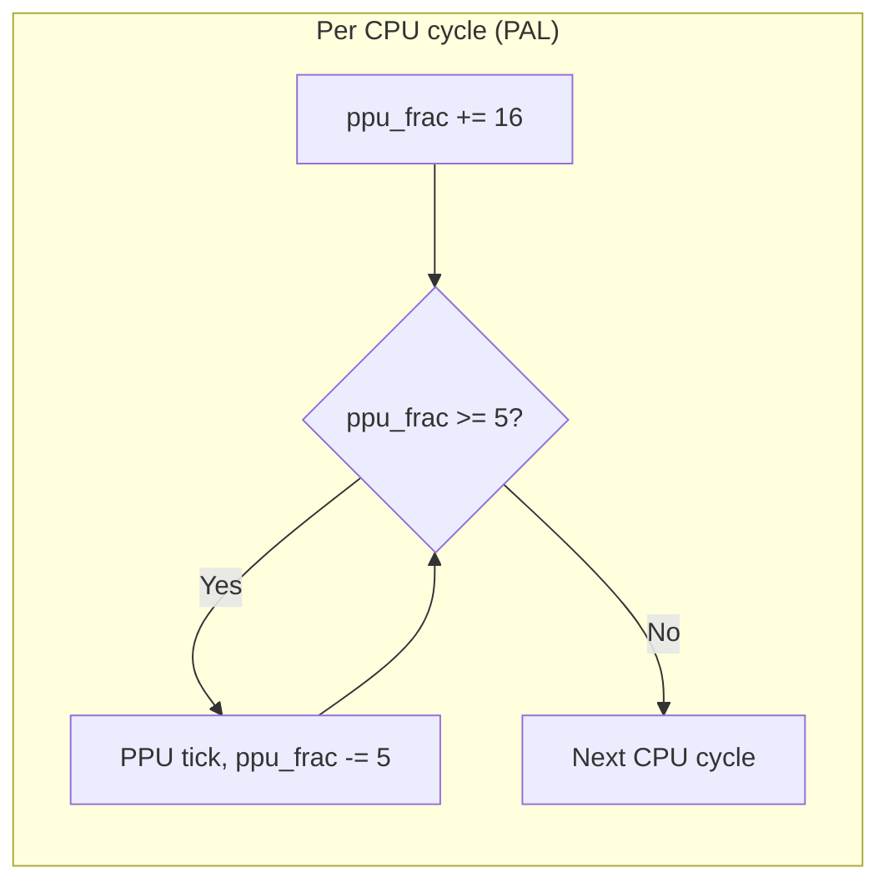
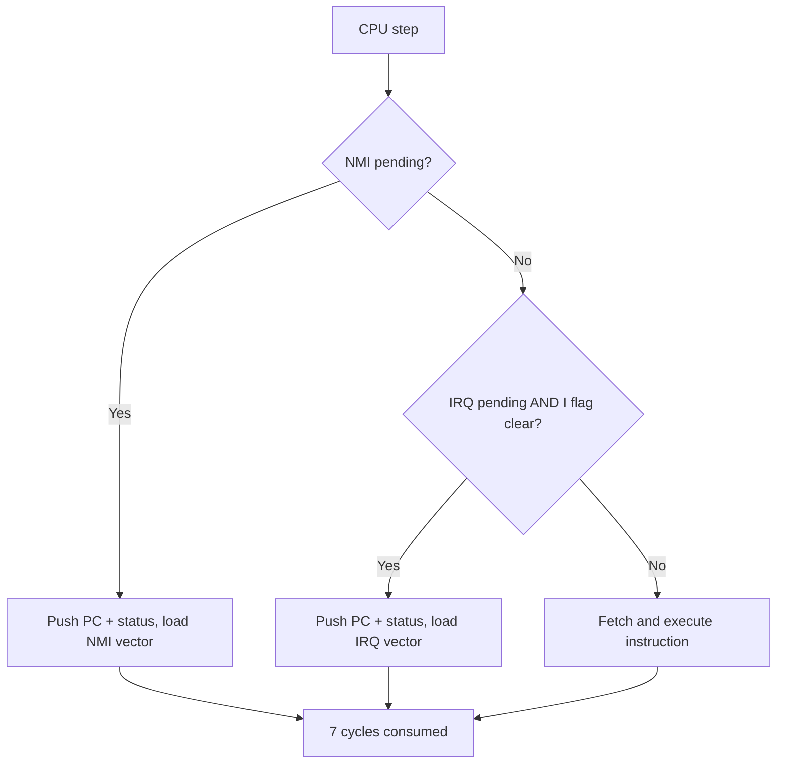

# Frame Loop & Synchronization

The emulation loop is the heart of nes-rs. It converts wall-clock time into the correct number of CPU, PPU, and APU cycles, keeping all three subsystems synchronized.

## High-level flow



## Time-to-cycles conversion

The frontend measures how much real time has passed since the last frame using `rl.get_time()` and passes the delta (in milliseconds) to `Nes::update()`:

```rust
let cpu_clock_hz = self.region.cpu_clock_hz();
let cpu_cycles_per_ms = f64::from(cpu_clock_hz) / 1000.0;
let target_cycles = (dt_ms * cpu_cycles_per_ms) as u64;
```

For NTSC at 60 FPS, each frame is ~16.67 ms, which works out to approximately 29,830 CPU cycles per frame. The delta is capped at 33 ms to prevent the emulator from trying to catch up after a stall (e.g., from an OS file dialog).

## The inner loop

Within `update()`, the emulator runs one CPU instruction at a time:

```rust
while cycles_run < target_cycles {
    let step = self.cpu_step();
    let cycles = step.cycles();
    cycles_run += cycles;

    // APU: tick once per CPU cycle
    for _ in 0..cycles {
        apu.tick();
        // Down-sample to 44.1 kHz via Bresenham
    }

    // PPU: tick ppu_num/ppu_den dots per CPU cycle
    for _ in 0..cycles {
        ppu_frac += ppu_num;
        while ppu_frac >= ppu_den {
            ppu_frac -= ppu_den;
            ppu.tick(mapper, &mut fb);
        }
    }
}
```

This is an **instruction-level** synchronization approach — after each CPU instruction completes, the APU and PPU are caught up to the same point in time. This is accurate enough for most games while avoiding the overhead of cycle-exact interleaving.

## CPU-PPU synchronization

The PPU runs faster than the CPU — 3 dots per CPU cycle on NTSC, 3.2 on PAL. The non-integer PAL ratio is handled with a Bresenham accumulator:



Over 5 CPU cycles, this produces exactly 16 PPU ticks — 3 ticks on some cycles and 4 on others, distributed evenly.

## Interrupt flow

Interrupts are checked at the start of each CPU step, before the instruction executes:



NMI sources:
- PPU VBlank (scanline 241, cycle 1) when NMI is enabled in PPUCTRL

IRQ sources:
- APU frame counter (4-step mode, step 3)
- APU DMC end-of-sample
- Mapper scanline counter (MMC3)

## Double buffering

The PPU renders into a **back buffer**. When a frame is complete (the PPU wraps from the pre-render scanline back to scanline 0), the back buffer and front buffer are swapped:

```rust
TickOutput::FrameReady => {
    std::mem::swap(&mut self.fb, &mut self.fb_front);
    self.frame_ready = true;
}
```

The frontend always reads from `fb_front`, which holds the last complete frame. This prevents tearing from displaying a partially-rendered frame.
