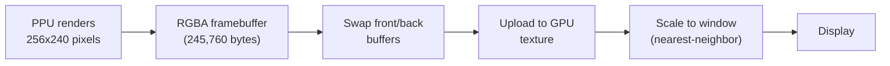
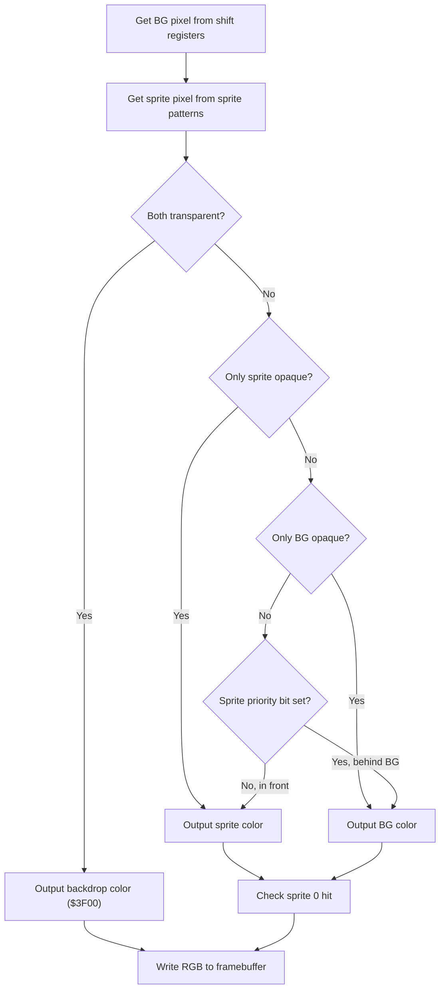

# Video Pipeline

This chapter describes the complete path from NES pixel data to the screen.

## Pipeline overview



## Framebuffer

The NES screen is 256 pixels wide and 240 pixels tall. nes-rs stores this as a flat array of RGBA bytes in row-major order:

```
pixels: Vec<u8>  // 256 * 240 * 4 = 245,760 bytes
```

Each pixel is stored as `[R, G, B, A]`, where A is always 255. This layout matches what GPU texture uploads expect, so no conversion is needed.

### Color conversion

The PPU works with 6-bit palette indices (0–63). When writing a pixel, the emulator converts the index to RGB using a hardcoded 64-entry color table (the "Wavebeam" palette):

```rust
let system_color = ppu.palette[pal_index & 0x1F];
let rgb = palette::lookup(system_color);  // → [u8; 3]
fb.set_pixel(x, y, rgb);
```

## Texture upload

Each frame, the frontend uploads the framebuffer bytes to a raylib `Texture2D`:

```rust
texture.update_texture(emu.framebuffer().as_bytes());
```

The texture uses **nearest-neighbor filtering** (`TEXTURE_FILTER_POINT`) to preserve the sharp pixel edges of the NES output. Bilinear filtering would blur the pixels, which is undesirable for pixel art.

## Scaling

The 256x240 texture is drawn to the window using `draw_texture_pro()`, which maps a source rectangle to a destination rectangle. The destination rectangle depends on the selected scale mode:

### Centered

No scaling. The native 256x240 image is centered in the window:

```rust
let x = (win_w - 256.0) / 2.0;
let y = (win_h - 240.0) / 2.0;
Rectangle::new(x, y, 256.0, 240.0)
```

### Aspect Fit

Scales uniformly to fill the window while preserving the 256:240 aspect ratio. Black bars appear on the shorter axis (letterbox or pillarbox):

```rust
let scale = (win_w / 256.0).min(win_h / 240.0);
let w = 256.0 * scale;
let h = 240.0 * scale;
let x = (win_w - w) / 2.0;
let y = (win_h - h) / 2.0;
Rectangle::new(x, y, w, h)
```

### Stretch

Fills the entire window, ignoring aspect ratio:

```rust
Rectangle::new(0.0, 0.0, win_w, win_h)
```

## Rendering the pixel

The PPU's pixel composition process for each visible dot (cycles 1–256, scanlines 0–239):



The background pixel is extracted from two 16-bit shift registers (pattern data) and two 8-bit shift registers (attribute/palette data), offset by the fine X scroll value.

The sprite pixel comes from the pre-evaluated sprite pattern data for the current scanline. The first non-transparent sprite (in OAM order) wins — this is the hardware priority system.
